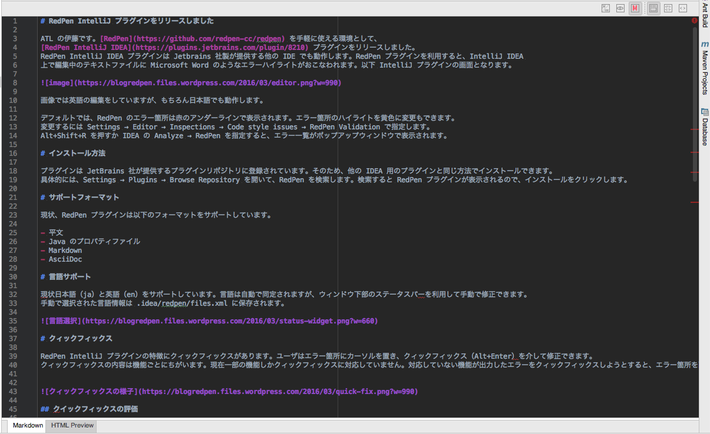
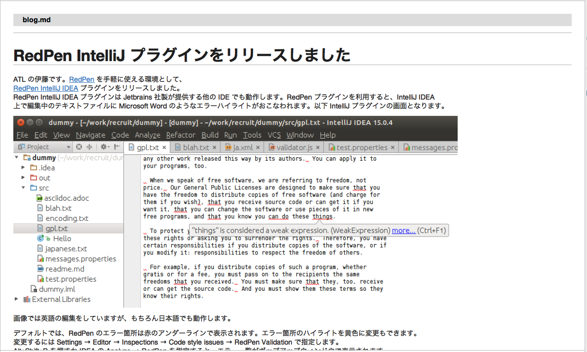

# RedPen IntelliJ プラグインをリリースしました

ATL の伊藤です。[RedPen](https://github.com/redpen-cc/redpen) を手軽に使える環境として、
[RedPen IntelliJ IDEA](https://plugins.jetbrains.com/plugin/8210) プラグインをリリースしました。
RedPen IntelliJ IDEA プラグインは Jetbrains 社製が提供する他の IDE でも動作します。RedPen プラグイン
を利用すると、IntelliJ IDEA で編集中のテキストファイルに Microsoft Word のようなエラーハイライトがおこ
なわれます。以下 IntelliJ プラグインの画面となります。


画像では英語の編集をしていますが、もちろん日本語でも動作します。

デフォルトでは、RedPen のエラー箇所は赤のアンダーラインで表示されます。エラー箇所のハイライトを黄色に変更もできます。
変更するには Settings → Editor → Inspections → Code style issues → RedPen Validation で指定します。
Alt+Shift+R を押すか IDEA の Analyze → RedPen を指定すると、エラー一覧がポップアップウィンドウで表示されます。

# インストール方法

プラグインは JetBrains 社が提供するプラグインリポジトリに登録されています。そのため、他の IDEA 用のプラグインと
同じ方法でインストールできます。具体的には、Settings → Plugins → Browse Repository を開いて、RedPen を検索します。
検索すると RedPen プラグインが表示されるので、インストールをクリックします。

# サポートフォーマット

現状、RedPen プラグインは以下のフォーマットをサポートしています。

- 平文
- Java のプロパティファイル
- Markdown
- AsciiDoc

# 言語サポート

現状日本語（ja）と英語（en）をサポートしています。言語は自動で同定されますが、ウィンドウ下部のステータスバーを利用して
手動で修正できます。手動で選択された言語情報は .idea/redpen/files.xml に保存されます。


# クィックフィックス

RedPen IntelliJ プラグインの特徴にクィックフィックスがあります。ユーザはエラー箇所にカーソルを置き、クィックフィックス
（Alt+Enter）を介して修正できます。クィックフィックスの内容は機能ごとにちがいます。現在一部の機能しかクィックフィックス
に対応していません。対応していない機能が出力したエラーをクィックフィックスしようとすると、エラー箇所を削除するか聞かれます。


## クィックフィックスの評価

クィックフィクス機能は最後につけた機能ですが、実は一番英語圏ユーザからの受けがいいです。JetBranis 社の Haidi 先生からもポジティブな
評価をいただきました。

<blockquote class="twitter-tweet" data-lang="ja"><p lang="en" dir="ltr">Our users wanted Alt+Enter in Word. Why do that when you can bring writing to IntelliJ IDEA <a href="https://t.co/jk5giLrtHs">https://t.co/jk5giLrtHs</a> via <a href="https://twitter.com/mojavelinux">@mojavelinux</a></p>&mdash; Hadi Hariri (@hhariri) <a href="https://twitter.com/hhariri/status/708207049235173376">2016年3月11日</a></blockquote>
<script async src="//platform.twitter.com/widgets.js" charset="utf-8"></script>

# 設定

RedPen の特徴は設定の柔軟性です。ユーザは利用する機能を追加、削除したり、規約に適合するように設定項目を調整できます。
RedPen IntelliJ プラグインでは設定を UI を利用して行います。Settings → Editor → RedPen で RedPen の設定画面が
ひらきます。 


機能（Validator）はチェックボックスを非選択にしすると RedPen は機能を利用しなくなります。機能のプロパティは表のプロパティ
部分をクリックして直接編集します。プロパティは複数選択でき、セミコロンで分割します。プロパティには不正な表現の辞書ファイルの
場所などを指定できます。


# 設定のインポート・エクスポート

ユーザがすでに RedPen の設定ファイルを持っている場合には、お手持ちの設定をインポートできます。
インポートするには Import ボタンを押した後、設定ファイルのパスを指定します。

Export ボタンを押すと、現在の設定が指定した場所にエクスポートできます。Export ボタンは将来、設定を使いまわしたい場合に利用
してください。ユーザが設定を変更した時に、設定は .idea/redpen ディレクトリ以下に保存されます。ですので、チームで設定を使い
まわしたい時には .idea ごとバージョン管理システムに追加するとよいでしょう。

# JavaScript で機能追加

RedPen IntelliJ IDEA プラグインでは JavaScript での機能拡張もサポートしています。JavaScript を利用した機能拡張を作成
する方法については[こちら](http://atl.recruit-tech.co.jp/blog/3629/)を参照してください。デフォルトでは、IntelliJ
IDEA は .idea/redpen/js ディレクトリに存在する JavaScript ファイルをロードします。 また、読み込むディレクトリは 
**script_path** プロパティを利用すると変更できます。

# 設定ファイルの直接編集

RedPen の設定ファイル（XML）.idea/redpen ディレクトリに保存されます。直接編集した際に設定をリロードするにはプロジェクトの再起動が必要になります。これに対し、RedPen プラグインの設定から編集した場合には設定は即座に反映されます。

## 辞書のサポート
 

RedPen の機能の多くは辞書をサポートしています。辞書をサポートする気の多くは list と dict プロパティを提供します。list プロパティは小規模の辞書として使用します。各要素は以下の例のようにコンマによって分割します。

```
list=apples,oranges
```

dict プロパティで指定する辞書ファイルは .idea/redpen に保存します。辞書を保存したのち、dict プロパティでファイルを指定します。以下は辞書を指定する設定例です。
 
```
dict=mywords.txt
```

# サンプル

本ブログポストを書いた IDEA のプロジェクトを[ここ](https://github.com/takahi-i/redpen-intellij-sample-ja)に置きました。参考にしてください。以下は IntelliJ で本ブログを編集しているウィンドウです。



本ブログの執筆では、IntelliJ の Markdown プラグインを併用して執筆しています。Markdown プラグインを使用すると執筆中にマークダウンのプレビュー画面が見えて便利です。




# RedPen v1.5 もあわせてリリース

RedPen IntelliJ プラグインに合わせて、RedPen v1.5もリリースしました。v1.5では大きく二つの強化が行われました。
 
 - Java のプロパティファイルが入力フォーマットとしてサポート
 - Wiki パーサがエラー箇所のオフセット情報を出力


# RedPen IntelliJ プラグインの今後

今後、RedPen IntelliJ プラグインの開発は一旦落ち着きます。IntelliJ プラグインを開発する中で、英語の対応を優先しすぎて日本語のデフォルト設定に一部好ましくない点があります。
しばらくは、細かな修正を積み重ねて行く予定です。
